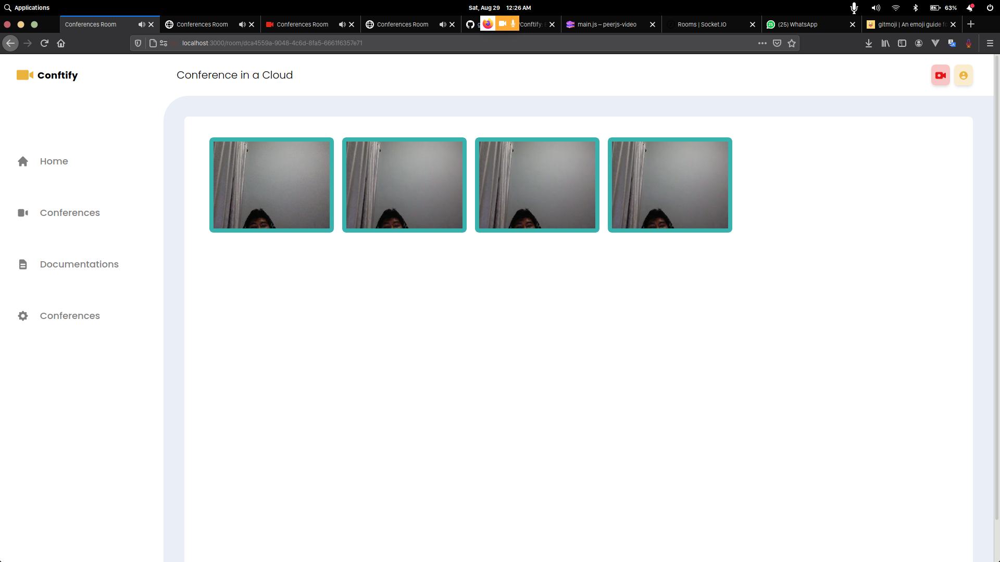

# Conftify
Conftify is a simple peer-to-peer(P2P) Online meeting application using Web real-time communication (WebRTC), Conftify run on expressJS framework to handle the Route and PeerJS module to handle peer-to-peer with WebRTC.



## Step to run the application

Clone this repository and navigate your terminal to the cloned repository

```console
foo@bar:~$ git clone https://github.com/ghazimuharam/Conftify.git
foo@bar:~/Conftify$ npm install
foo@bar:~/Conftify$ npm run start
```

Please make sure you have installed [PeerJS-server](https://github.com/peers/peerjs-server)

Run command below to install PeerServer globally using npm

```console
foo@bar:~$ npm install peer -g
```

Conftify use PeerServer on port 3001, so you should run the server on port 3001 using this command
```console
foo@bar:~$ peerjs --port 3001
```